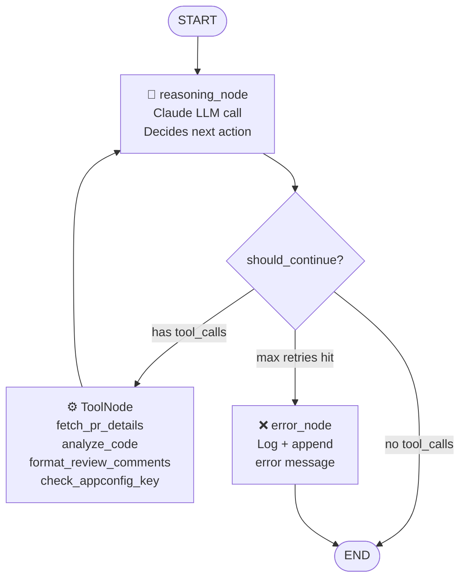

# DevOps Agent - Graph Flows

## PR Review Graph

The current implementation uses the **ReAct pattern** (Reason → Act → Observe → repeat).
Claude reasons, picks a tool, observes the result, reasons again until it produces a final answer.

